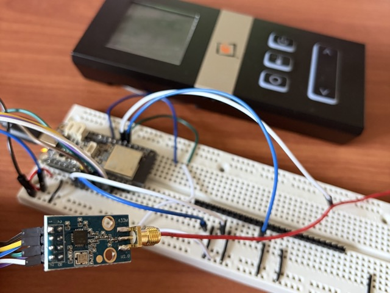

# circuitpython-proflame2-cc1101

Control a Proflame 2 fireplace using a CC1101 transciever and CircuitPython



## Introduction

This library controls Proflame 2 fireplace using a CC1101 transciever and the CircuitPython language. What makes this library unique compared to prior art is that it uses the CC1101 in FIFO mode (more reliable but a bit trickier to configure than asynchronous), it implements the Proflame 2 protocol and it works with CircuitPython. Also, I put some work into explaining the registers for those who are interested in CC1101 dev (cool!) or who are having troubles where the transmission isn't working (more likely, no worries - check out the Troubleshooting section below).

To control the Proflame 2, you are going to need to capture your Proflame 2 transmitter's signal. I used rtl-sdr blog v4 kit for this. It was $50 when I bought it March 2026. Capturing the transmitter's signal is necessary for two reasons. First, you need to get the transmitter's unique serial code (alternatively, see [proflame2-esp](https://github.com/j2deen/proflame2-esp) for instructions on generating/pairing a new serial code). Second, you need to capture the control words associated with the fireplace desired state.

### Usage

NOTE: `PROFLAME_TX_SERIAL` must be set and the boards must be properly wired. See Setup section.

Turn fireplace on to flame level 2:
```python
import proflame2_cc1101

on_packet = proflame2_cc1101.get_packet(serial=PROFLAME_TX_SERIAL, cmd1=0x01, cmd2=0x82, err1=0x35, err2=0xc5)

spi, cs = proflame2_cc1101.configure(sck_pin=board.SCK, mosi_pin=board.MOSI, miso_pin=board.MISO, csn_pin=board.A5)
proflame2_cc1101.send(off_packet, spi, cs)
```

Turn fireplace off:
```python
import proflame2_cc1101

off_packet = proflame2_cc1101.get_packet(serial=PROFLAME_TX_SERIAL, cmd1=0x00, cmd2=0x82, err1=0x14, err2=0xc5)

spi, cs = proflame2_cc1101.configure(sck_pin=board.SCK, mosi_pin=board.MOSI, miso_pin=board.MISO, csn_pin=board.A5)
proflame2_cc1101.send(off_packet, spi, cs)
```

### Limitations

This library supports only TX, not RX. The Proflame receiver does repeat back a successfully received signal, so RX could be helpful in confirming the signal was received.

Also, this library requires the user to know the desired command words. There are other libraries that can be used to generate the control words (see Prior Art). However, there seems to be some confusion on how to generate the Err1 and Err2 words (see RTL_433 LINK HERE). Generating command words could be useful for supporting many different fireplace setting configurations with ease.

### Status

This project is in active development and issues / prs are welcome.


## Setup

### Install

Copy `proflame2_cc1101.py` to the `/lib` folder in the microcontroller.

### Proflame 2 Serial Code and Command Words

The Proflame 2 Transmitter serial code can be obtained using a sdr receiver and [rtl_433](https://github.com/merbanan/rtl_433).

Start rtl_433 in the mode for recognizing the Proflame 2 transmission:

`rtl_433 -f 314973000 -s 250000 -R 207`

Then press any button on the transmitter.

The serial code is obtained from the `Id` field in the rtl_433 printout and the command words are indicated in their labels. They can be converted to hex by prepending `0x` so a value of `aaaaaa` becomes `0xaaaaaa`.

### Wiring

This is the recommended wiring. The CSN pin can be moved to any IO pin on the Feather.

| CC1101 Pin | Feather Pin | Purpose |
| --- | --- | --- |
| **VCC/GND** | **3V/GND** | Power |
| **SCK/MOSI/MISO** | **SCK/MOSI/MISO** | SPI Configuration Bus |
| **CSN** | **A4** (Default) | SPI Chip Select |

### Antenna

The antenna connected to the CC1101 needs to be the proper length to support transmitting at 315MHz. A great option is a wire cut to 9.4in. I didn't have room for that so I cut mine to 7in and it is working just fine.

## Background

### Proflame 2 Transmitter

The specific Proflame 2 Transmitter this project was tested with is T99058404300. The test report, available from the [FCC T99058404300 exhibits page](https://apps.fcc.gov/oetcf/eas/reports/ViewExhibitReport.cfm?mode=Exhibits&RequestTimeout=500&calledFromFrame=N&application_id=Irrbj6TtSTeYQAa0r61skA%3D%3D&fcc_id=T99058404300), shows the center frequency is 314.9575. The Proflame 2 Transmitter protocol was first described in https://github.com/johnellinwood/smartfire (for FCC T99058402300, different ID than the one used for testing this library but same behavior) and then support for the Proflame Transmitter was added to rtl_433 ([rtl_433 issue 1905](https://github.com/merbanan/rtl_433/issues/1905)) in 2021. 

Look at the [rtl_433 proflame.c file](https://github.com/merbanan/rtl_433/blob/master/src/devices/proflame2.c) to see how it expects a signal to be. Here is an excerpt from the header:

> The command bursts are transmitted at 314,973 KHz using On-Off Keying (OOK).
> Transmission rate is 2400 baud. Packet is transmitted 5 times, repetitions are separated by 12 low amplitude bits (zeros).
> 
> Encoded with a variant of Thomas Manchester encoding:
> 0 is represented by 01, a 1 by 10, zero padding (Z) by 00, and synchronization words (S) as 11.
> The encoded command packet is 182 bits, and the decoded packet is 91 bits.
> 
> A packet is made up of 7 words, each 13 bits,
> starts with a synchronization symbol, followed by a 1 as a guard bit,
> then 8 bits of data, a padding bit, a parity bit, and finally a 1 as an end guard bit.
> The padding bit is 1 for the first word and 0 for all other words.
> The parity bit is calculated over the data bits and the padding bit,
> and is 0 if there are an even number of ones and 1 if there are an odd number of ones.
> 
> The payload data is 7 bytes:
> 
> - Serial 1
> - Serial 2
> - Serial 3
> - Command 1
> - Command 2
> - Error Detection 1
> - Error Detection 2

### CC1101 Configuration

The Proflame protocol does not match any of the built-in protocols supported by CC1101 by default. Therefore, it is necessary to disable a lot of CC1101 'helpers' using the registers. Also, the CC1101 simply needs to be configured to use the right carrier frequencies, baud, etc. An essential reference for this is the [CC1101 technical datasheet](https://www.ti.com/lit/ds/symlink/cc1101.pdf?ts=1773350741330&ref_url=https%253A%252F%252Fwww.ti.com%252Fproduct%252FCC1101). The header settings and explanations are also available in the source code.

By default, the CC1101 hardware automatically injects a preamble and a sync word before the transmitted data and also a CRC afterward. To disable this behavior, the following register values should be set:

- `MDMCFG1`: 0x00 - set preamble length to zero, and set channel spacing to zero.
- `PKTCTRL0`: 0x00 - turn off data whitening, use FIFOs for TX, disable CRC calculation, and use fixed packet length mode.
- `PKTCTRL1`: 0x00 - do not append status

The Proflame 2 transmits at 314.973MHz and encodes the data in its own unique encoding. The following registry values enable Proflame protocol support:

- `FREQ2`: 0x0C, `FREQ1`: 0x1D, `FREQ0`: 0x89 - Set transmit frequency to 314.973MHz. frequency = (FREQ2:FREQ1:FREQ0) × 26MHz / 2^16. (FREQ2:FREQ1:FREQ0) = frequency * 2^16 / 26MHz = 314.973 * 2^16 / 26 = 793,993 = 0x0C1D89.
- `MDMCFG2`: 0b000000110000 - ASK/OOK modulation format, no preamble, no manchester encoding
- `MDMCFG4`: 0b11110110, `MDMCFG3`: 0x83 - Set baud to 2400. baud = (256+DRATE_M) × 2^DRATE_E × 26MHz / 2^28. DRATE_E=6, DRATE_M=131.
- `PKTLEN`: 120 - 7 words at 26 bits per word, repeated 5 times with a gap of 12 zeros and buffered to the next byte
- `TEST0` : 0x09 - Disable VCO selection calibration, required for the 300–348 MHz band
- `FSCAL3`: 0b11101010 - The important parts are bits 4-7, enable charge pump calibration and use SmartRF Studio value for band-specific calibration configuration

Additionally, the PA table is configured for OOK (on-off keying) encoding.

## Troubleshooting

Confirm that the Proflame2 protocol is recognized using a sdr receiver and [rtl_433](https://github.com/merbanan/rtl_433) with the following command:

`rtl_433 -f 314973000 -s 250000 -R 207`

If it is not recognized, look at the raw bits being received with:

`rtl_433 -f 314973000 -s 250000 -X "n=proflame,m=OOK_PCM,s=416,l=416,r=8320"`

The readout will also let you know if the Proflame2 protocol is detected.

If you are still having troubles, use [urh](https://github.com/jopohl/urh) to inspect the transmission. First, ensure the device is transmitting at 314.97MHz (and set the analysis frequency) with the Spectrum Analyzer. If nothing shows up around 315MHz, the CC1101 isn't transmitting at that frequency. Make sure the CC1101 is indeed transmitting and that the registers to transmit at 314.974Mhz are being set.

Next, use Record Signal to record a transmission from the device. Save the signal. In the Interpretation tab, set samples/symbol to 417 and confirm the encoding is ASK. Zoom in on the transmission and verify that it looks like 5 bursts separated by gaps. 

Finally, use the Analysis tab to verify the following:

- 5 messages are detected (or a multiple of 5 if more than one transmissione was recorded)
- Most of the messages are 181 bits in length (some of the bursts may have lost bits, these are usually on the ends)
- The messages look identical where all bits exist
- The pattern `111` shows up exactly 7 times in a message

If `111` shows up more or less than 7 times, this likely means the CC1101 is garbling the data and you need to dive into the registers to disable any modulation or pre/post ambles.

## Prior Art / Acknowledgements 

The libraries that I found helpful in this endeavor: 
* [proflame2-esp](https://github.com/j2deen/proflame2-esp) -provides the CC1101 Asynchronous mode registries for implementing the Proflame 2 protocol
* [CPY-CC1101](https://github.com/unixb0y/CPY-CC1101) -demonstrates controlling a CC1101 in Asynchronous mode with CircuitPython
* [SmartFire](https://github.com/johnellinwood/smartfire) -provides the original Proflame 2 protocol research
* [rtl_433](https://github.com/merbanan/rtl_433) -implements support for the Proflame protocol 